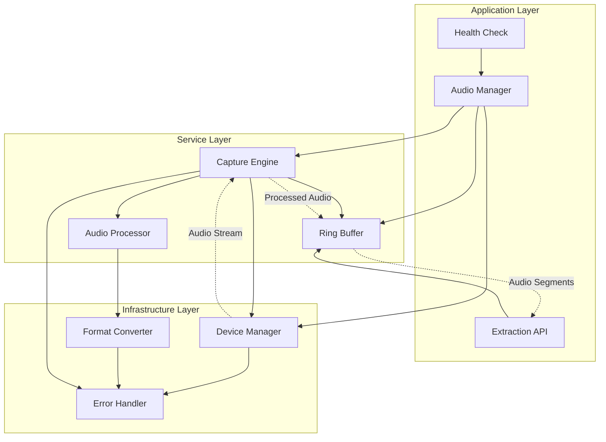

# Phase 2: Audio Capture System - Low Level Design

## Architecture Overview

The audio capture system follows a layered architecture with clear separation of concerns:



## Package Structure

```
pkg/audio/
├── manager.go          # Main audio manager and public API
├── capture/
│   ├── engine.go       # Core capture engine
│   ├── device.go       # Audio device management
│   └── stream.go       # Audio stream handling
├── buffer/
│   ├── ring.go         # Ring buffer implementation
│   ├── segment.go      # Audio segment handling
│   └── metadata.go     # Timestamp and metadata tracking
├── processing/
│   ├── converter.go    # Format conversion
│   ├── preprocessor.go # Audio preprocessing
│   └── quality.go      # Audio quality assessment
├── types/
│   ├── audio.go        # Core audio types
│   ├── config.go       # Configuration types
│   └── errors.go       # Error types
└── internal/
    ├── portaudio.go    # PortAudio wrapper
    └── utils.go        # Internal utilities
```

## Core Data Structures

### Audio Configuration Types

```go
// AudioConfig represents the complete audio system configuration
type AudioConfig struct {
    Device     DeviceConfig     `mapstructure:"device"`
    Buffer     BufferConfig     `mapstructure:"buffer"`
    Processing ProcessingConfig `mapstructure:"processing"`
    Extraction ExtractionConfig `mapstructure:"extraction"`
}

// DeviceConfig specifies audio device settings
type DeviceConfig struct {
    Name            string        `mapstructure:"name"`              // Target device name
    ID              int           `mapstructure:"id"`                // Device ID (-1 for auto)
    SampleRate      int           `mapstructure:"sample_rate"`       // 44100, 48000, etc.
    Channels        int           `mapstructure:"channels"`          // 1 (mono) or 2 (stereo)
    BitDepth        int           `mapstructure:"bit_depth"`         // 16, 24, 32
    FramesPerBuffer int           `mapstructure:"frames_per_buffer"` // Buffer size
    FallbackDevices []string      `mapstructure:"fallback_devices"`  // Fallback device names
    MonitorInterval time.Duration `mapstructure:"monitor_interval"`  // Device health check interval
}

// BufferConfig specifies ring buffer settings
type BufferConfig struct {
    Duration        time.Duration `mapstructure:"duration"`         // Total buffer duration (60s)
    SegmentSize     time.Duration `mapstructure:"segment_size"`     // Individual segment size (1s)
    OverwritePolicy string        `mapstructure:"overwrite_policy"` // "oldest", "circular"
    PreallocateSize int           `mapstructure:"preallocate_size"` // Memory preallocation
}

// ProcessingConfig specifies audio processing settings
type ProcessingConfig struct {
    EnablePreprocessing bool    `mapstructure:"enable_preprocessing"`
    NoiseReduction     bool    `mapstructure:"noise_reduction"`
    Normalization      bool    `mapstructure:"normalization"`
    HighpassFilter     float64 `mapstructure:"highpass_filter"`     // Hz
    LowpassFilter      float64 `mapstructure:"lowpass_filter"`      // Hz
    VADThreshold       float64 `mapstructure:"vad_threshold"`       // Voice activity detection
}

// ExtractionConfig specifies extraction settings
type ExtractionConfig struct {
    DefaultDuration    time.Duration `mapstructure:"default_duration"`     // 10s
    MaxConcurrent      int           `mapstructure:"max_concurrent"`       // 5
    OutputFormat       string        `mapstructure:"output_format"`        // "wav", "raw"
    OutputSampleRate   int           `mapstructure:"output_sample_rate"`   // 16000 for whisper
    OutputChannels     int           `mapstructure:"output_channels"`      // 1 for whisper
    TimestampPrecision time.Duration `mapstructure:"timestamp_precision"`  // 10ms
}
```

### Core Audio Types

```go
// AudioSample represents a single audio sample
type AudioSample struct {
    Data      []float32   // Audio data (normalized -1.0 to 1.0)
    Timestamp time.Time   // Capture timestamp
    Channels  int         // Number of channels
    SampleRate int        // Sample rate
}

// AudioSegment represents a segment of audio data
type AudioSegment struct {
    ID        string      // Unique segment identifier
    Data      []float32   // Audio samples
    StartTime time.Time   // Segment start timestamp
    EndTime   time.Time   // Segment end timestamp
    Duration  time.Duration // Segment duration
    Metadata  SegmentMetadata // Additional metadata
}

// SegmentMetadata contains additional information about audio segments
type SegmentMetadata struct {
    SampleRate    int     // Original sample rate
    Channels      int     // Number of channels
    BitDepth      int     // Bit depth
    Quality       float64 // Quality score (0.0-1.0)
    HasVoice      bool    // Voice activity detected
    NoiseLevel    float64 // Background noise level
    PeakAmplitude float64 // Peak amplitude in segment
    RMSLevel      float64 // RMS level
}

// DeviceInfo represents audio device information
type DeviceInfo struct {
    ID                int     // Device ID
    Name              string  // Device name
    MaxInputChannels  int     // Maximum input channels
    MaxOutputChannels int     // Maximum output channels
    DefaultSampleRate float64 // Default sample rate
    IsDefault         bool    // Is default device
    IsAvailable       bool    // Is currently available
}
```

## Ring Buffer Implementation

### Ring Buffer Core Structure

```go
// RingBuffer implements a thread-safe circular audio buffer
type RingBuffer struct {
    mu           sync.RWMutex    // Protects buffer operations
    data         []float32       // Audio data storage
    writePos     int64           // Current write position
    readPos      int64           // Current read position
    size         int64           // Buffer size in samples
    sampleRate   int             // Sample rate
    channels     int             // Number of channels
    segmentSize  int64           // Size of each segment in samples
    segments     []SegmentInfo   // Segment metadata
    overwritten  int64           // Number of overwritten samples
    totalWritten int64           // Total samples written
    startTime    time.Time       // Buffer start time
    lastWrite    time.Time       // Last write timestamp
}

// SegmentInfo tracks metadata for buffer segments
type SegmentInfo struct {
    StartPos   int64     // Start position in buffer
    EndPos     int64     // End position in buffer
    Timestamp  time.Time // Segment timestamp
    Quality    float64   // Audio quality score
    HasVoice   bool      // Voice activity detected
    NoiseLevel float64   // Noise level
}

// NewRingBuffer creates a new ring buffer with specified configuration
func NewRingBuffer(config BufferConfig, sampleRate, channels int) *RingBuffer {
    totalSamples := int64(config.Duration.Seconds() * float64(sampleRate) * float64(channels))
    segmentSamples := int64(config.SegmentSize.Seconds() * float64(sampleRate) * float64(channels))
    
    return &RingBuffer{
        data:        make([]float32, totalSamples),
        size:        totalSamples,
        sampleRate:  sampleRate,
        channels:    channels,
        segmentSize: segmentSamples,
        segments:    make([]SegmentInfo, totalSamples/segmentSamples),
        startTime:   time.Now(),
    }
}

// Write adds audio data to the ring buffer
func (rb *RingBuffer) Write(samples []float32, timestamp time.Time) error {
    rb.mu.Lock()
    defer rb.mu.Unlock()
    
    if len(samples) == 0 {
        return ErrEmptyData
    }
    
    // Calculate write positions
    startPos := rb.writePos % rb.size
    endPos := (rb.writePos + int64(len(samples))) % rb.size
    
    // Handle buffer wrap-around
    if endPos < startPos {
        // Write in two parts: to end of buffer, then from beginning
        firstPart := rb.size - startPos
        copy(rb.data[startPos:], samples[:firstPart])
        copy(rb.data[0:endPos], samples[firstPart:])
    } else {
        // Simple write
        copy(rb.data[startPos:startPos+int64(len(samples))], samples)
    }
    
    // Update positions and metadata
    rb.writePos += int64(len(samples))
    rb.totalWritten += int64(len(samples))
    rb.lastWrite = timestamp
    
    // Update segment metadata
    rb.updateSegmentMetadata(startPos, int64(len(samples)), timestamp)
    
    return nil
}

// Extract retrieves audio data from the ring buffer
func (rb *RingBuffer) Extract(duration time.Duration, endTime time.Time) (*AudioSegment, error) {
    rb.mu.RLock()
    defer rb.mu.RUnlock()
    
    // Calculate sample count for requested duration
    sampleCount := int64(duration.Seconds() * float64(rb.sampleRate) * float64(rb.channels))
    
    // Determine extraction range
    endPos := rb.timeToPosition(endTime)
    startPos := endPos - sampleCount
    
    // Validate extraction range
    if startPos < 0 || startPos < rb.writePos-rb.size {
        return nil, ErrInsufficientData
    }
    
    // Extract data
    data := make([]float32, sampleCount)
    if err := rb.extractRange(startPos, sampleCount, data); err != nil {
        return nil, err
    }
    
    // Create segment with metadata
    segment := &AudioSegment{
        ID:        generateSegmentID(),
        Data:      data,
        StartTime: endTime.Add(-duration),
        EndTime:   endTime,
        Duration:  duration,
        Metadata:  rb.calculateSegmentMetadata(startPos, sampleCount),
    }
    
    return segment, nil
}
```

## Audio Capture Engine

### Capture Engine Structure

```go
// CaptureEngine manages continuous audio capture
type CaptureEngine struct {
    mu            sync.RWMutex
    config        DeviceConfig
    device        *AudioDevice
    stream        *AudioStream
    buffer        *RingBuffer
    processor     *AudioProcessor
    running       bool
    stopChan      chan struct{}
    errorChan     chan error
    statsChan     chan CaptureStats
    logger        zerolog.Logger
    metrics       *CaptureMetrics
}

// CaptureStats represents capture performance statistics
type CaptureStats struct {
    SamplesProcessed int64         // Total samples processed
    DroppedSamples   int64         // Samples dropped due to overruns
    AverageLatency   time.Duration // Average processing latency
    BufferUtilization float64      // Buffer utilization percentage
    DeviceHealth     DeviceHealth  // Device health status
    LastUpdate       time.Time     // Last statistics update
}

// DeviceHealth represents audio device health status
type DeviceHealth struct {
    IsConnected    bool          // Device connection status
    SignalLevel    float64       // Input signal level
    NoiseFloor     float64       // Background noise level
    LastHeartbeat  time.Time     // Last successful operation
    ErrorCount     int           // Recent error count
    WarningCount   int           // Recent warning count
}

// NewCaptureEngine creates a new audio capture engine
func NewCaptureEngine(config DeviceConfig, buffer *RingBuffer, logger zerolog.Logger) *CaptureEngine {
    return &CaptureEngine{
        config:    config,
        buffer:    buffer,
        stopChan:  make(chan struct{}),
        errorChan: make(chan error, 10),
        statsChan: make(chan CaptureStats, 1),
        logger:    logger.With().Str("component", "capture_engine").Logger(),
        metrics:   NewCaptureMetrics(),
    }
}

// Start begins continuous audio capture
func (ce *CaptureEngine) Start(ctx context.Context) error {
    ce.mu.Lock()
    defer ce.mu.Unlock()
    
    if ce.running {
        return ErrAlreadyRunning
    }
    
    // Initialize audio device
    device, err := ce.initializeDevice()
    if err != nil {
        return fmt.Errorf("failed to initialize device: %w", err)
    }
    ce.device = device
    
    // Create audio stream
    stream, err := ce.createAudioStream()
    if err != nil {
        return fmt.Errorf("failed to create stream: %w", err)
    }
    ce.stream = stream
    
    // Start capture loop
    ce.running = true
    go ce.captureLoop(ctx)
    go ce.monitoringLoop(ctx)
    
    ce.logger.Info().Msg("Audio capture started")
    return nil
}

// captureLoop runs the main audio capture loop
func (ce *CaptureEngine) captureLoop(ctx context.Context) {
    defer func() {
        ce.mu.Lock()
        ce.running = false
        ce.mu.Unlock()
        ce.cleanup()
    }()
    
    frameSize := ce.config.FramesPerBuffer * ce.config.Channels
    audioBuffer := make([]float32, frameSize)
    
    for {
        select {
        case <-ctx.Done():
            return
        case <-ce.stopChan:
            return
        default:
            // Capture audio frame
            timestamp := time.Now()
            if err := ce.stream.Read(audioBuffer); err != nil {
                ce.handleCaptureError(err)
                continue
            }
            
            // Process audio data
            processedData, err := ce.processor.Process(audioBuffer, timestamp)
            if err != nil {
                ce.logger.Warn().Err(err).Msg("Audio processing failed")
                processedData = audioBuffer // Use raw data as fallback
            }
            
            // Write to ring buffer
            if err := ce.buffer.Write(processedData, timestamp); err != nil {
                ce.logger.Error().Err(err).Msg("Failed to write to ring buffer")
                ce.metrics.IncrementDroppedSamples(int64(len(processedData)))
            } else {
                ce.metrics.IncrementProcessedSamples(int64(len(processedData)))
            }
            
            // Update statistics
            ce.updateStatistics(timestamp, len(processedData))
        }
    }
}
```

## Audio Processing Pipeline

### Audio Processor Structure

```go
// AudioProcessor handles real-time audio processing
type AudioProcessor struct {
    config       ProcessingConfig
    sampleRate   int
    channels     int
    
    // Processing components
    normalizer   *Normalizer
    noiseReducer *NoiseReducer
    filters      []AudioFilter
    vadDetector  *VADDetector
    qualityMeter *QualityMeter
    
    // Processing state
    processingBuffer []float32
    historyBuffer    []float32
    
    logger zerolog.Logger
}

// Process applies audio processing to input samples
func (ap *AudioProcessor) Process(samples []float32, timestamp time.Time) ([]float32, error) {
    if len(samples) == 0 {
        return samples, nil
    }
    
    // Ensure processing buffer is large enough
    if len(ap.processingBuffer) < len(samples) {
        ap.processingBuffer = make([]float32, len(samples))
    }
    
    // Copy input to processing buffer
    copy(ap.processingBuffer[:len(samples)], samples)
    processed := ap.processingBuffer[:len(samples)]
    
    // Apply processing pipeline
    if ap.config.EnablePreprocessing {
        // Apply filters
        for _, filter := range ap.filters {
            if err := filter.Apply(processed); err != nil {
                ap.logger.Warn().Err(err).Msg("Filter application failed")
            }
        }
        
        // Apply noise reduction
        if ap.config.NoiseReduction && ap.noiseReducer != nil {
            if err := ap.noiseReducer.Reduce(processed); err != nil {
                ap.logger.Warn().Err(err).Msg("Noise reduction failed")
            }
        }
        
        // Apply normalization
        if ap.config.Normalization && ap.normalizer != nil {
            if err := ap.normalizer.Normalize(processed); err != nil {
                ap.logger.Warn().Err(err).Msg("Normalization failed")
            }
        }
    }
    
    // Update processing history
    ap.updateHistory(processed)
    
    return processed, nil
}

// QualityMeter assesses audio quality
type QualityMeter struct {
    sampleRate int
    channels   int
    
    // Quality metrics
    rmsHistory    []float64
    peakHistory   []float64
    noiseEstimate float64
    snrHistory    []float64
}

// AssessQuality calculates quality metrics for audio segment
func (qm *QualityMeter) AssessQuality(samples []float32) SegmentMetadata {
    if len(samples) == 0 {
        return SegmentMetadata{}
    }
    
    // Calculate RMS level
    rms := qm.calculateRMS(samples)
    
    // Calculate peak amplitude
    peak := qm.calculatePeak(samples)
    
    // Estimate noise level
    noise := qm.estimateNoise(samples)
    
    // Calculate SNR
    snr := qm.calculateSNR(rms, noise)
    
    // Detect voice activity
    hasVoice := qm.detectVoiceActivity(samples, rms, snr)
    
    // Calculate overall quality score
    quality := qm.calculateQualityScore(rms, peak, snr, hasVoice)
    
    return SegmentMetadata{
        SampleRate:    qm.sampleRate,
        Channels:      qm.channels,
        Quality:       quality,
        HasVoice:      hasVoice,
        NoiseLevel:    noise,
        PeakAmplitude: peak,
        RMSLevel:      rms,
    }
}
```

## Audio Manager API

### Main Manager Interface

```go
// AudioManager provides the main interface for audio capture system
type AudioManager struct {
    config        AudioConfig
    captureEngine *CaptureEngine
    ringBuffer    *RingBuffer
    processor     *AudioProcessor
    deviceManager *DeviceManager
    extractor     *AudioExtractor
    
    // State management
    mu      sync.RWMutex
    running bool
    health  SystemHealth
    
    // Channels for communication
    statsChan   chan CaptureStats
    healthChan  chan SystemHealth
    errorChan   chan error
    
    logger zerolog.Logger
}

// SystemHealth represents overall system health
type SystemHealth struct {
    CaptureHealth  CaptureStats  // Capture engine health
    BufferHealth   BufferStats   // Ring buffer health
    DeviceHealth   DeviceHealth  // Audio device health
    ProcessorHealth ProcessorStats // Processor health
    OverallStatus  HealthStatus   // Overall system status
    LastUpdate     time.Time      // Last health update
}

// HealthStatus represents system health status
type HealthStatus int

const (
    HealthStatusUnknown HealthStatus = iota
    HealthStatusHealthy
    HealthStatusWarning
    HealthStatusCritical
    HealthStatusFailed
)

// NewAudioManager creates a new audio manager
func NewAudioManager(config AudioConfig, logger zerolog.Logger) (*AudioManager, error) {
    // Validate configuration
    if err := validateAudioConfig(config); err != nil {
        return nil, fmt.Errorf("invalid configuration: %w", err)
    }
    
    // Create ring buffer
    ringBuffer := NewRingBuffer(
        config.Buffer,
        config.Device.SampleRate,
        config.Device.Channels,
    )
    
    // Create audio processor
    processor := NewAudioProcessor(config.Processing, config.Device.SampleRate, config.Device.Channels)
    
    // Create capture engine
    captureEngine := NewCaptureEngine(config.Device, ringBuffer, logger)
    
    // Create device manager
    deviceManager := NewDeviceManager(config.Device, logger)
    
    // Create audio extractor
    extractor := NewAudioExtractor(config.Extraction, ringBuffer, logger)
    
    return &AudioManager{
        config:        config,
        captureEngine: captureEngine,
        ringBuffer:    ringBuffer,
        processor:     processor,
        deviceManager: deviceManager,
        extractor:     extractor,
        statsChan:     make(chan CaptureStats, 1),
        healthChan:    make(chan SystemHealth, 1),
        errorChan:     make(chan error, 10),
        logger:        logger.With().Str("component", "audio_manager").Logger(),
    }, nil
}

// Start begins audio capture
func (am *AudioManager) Start(ctx context.Context) error {
    am.mu.Lock()
    defer am.mu.Unlock()
    
    if am.running {
        return ErrAlreadyRunning
    }
    
    // Start device monitoring
    if err := am.deviceManager.Start(ctx); err != nil {
        return fmt.Errorf("failed to start device manager: %w", err)
    }
    
    // Start capture engine
    if err := am.captureEngine.Start(ctx); err != nil {
        return fmt.Errorf("failed to start capture engine: %w", err)
    }
    
    // Start health monitoring
    go am.healthMonitorLoop(ctx)
    
    am.running = true
    am.logger.Info().Msg("Audio manager started")
    
    return nil
}

// ExtractAudio extracts audio segment from ring buffer
func (am *AudioManager) ExtractAudio(ctx context.Context, req ExtractionRequest) (*AudioSegment, error) {
    if !am.running {
        return nil, ErrNotRunning
    }
    
    return am.extractor.Extract(ctx, req)
}

// GetHealth returns current system health
func (am *AudioManager) GetHealth() SystemHealth {
    am.mu.RLock()
    defer am.mu.RUnlock()
    return am.health
}

// GetStats returns current capture statistics
func (am *AudioManager) GetStats() CaptureStats {
    return am.captureEngine.GetStats()
}
```

## Error Handling Strategy

### Error Types and Handling

```go
// Audio system error types
var (
    ErrDeviceNotFound     = errors.New("audio device not found")
    ErrDeviceUnavailable  = errors.New("audio device unavailable")
    ErrInvalidFormat      = errors.New("invalid audio format")
    ErrBufferOverrun      = errors.New("audio buffer overrun")
    ErrBufferUnderrun     = errors.New("audio buffer underrun")
    ErrInsufficientData   = errors.New("insufficient audio data")
    ErrExtractionTimeout  = errors.New("audio extraction timeout")
    ErrConcurrencyLimit   = errors.New("extraction concurrency limit exceeded")
    ErrAlreadyRunning     = errors.New("audio system already running")
    ErrNotRunning         = errors.New("audio system not running")
    ErrEmptyData          = errors.New("empty audio data")
)

// ErrorHandler manages error handling and recovery
type ErrorHandler struct {
    logger        zerolog.Logger
    errorCounts   map[string]int
    lastErrors    map[string]time.Time
    recoveryFuncs map[string]func() error
    mu            sync.RWMutex
}

// HandleError processes and potentially recovers from errors
func (eh *ErrorHandler) HandleError(err error, context string) error {
    eh.mu.Lock()
    defer eh.mu.Unlock()
    
    errorType := eh.classifyError(err)
    eh.errorCounts[errorType]++
    eh.lastErrors[errorType] = time.Now()
    
    // Log error with context
    eh.logger.Error().
        Err(err).
        Str("context", context).
        Str("error_type", errorType).
        Int("count", eh.errorCounts[errorType]).
        Msg("Audio system error")
    
    // Attempt recovery if available
    if recoveryFunc, exists := eh.recoveryFuncs[errorType]; exists {
        if recoveryErr := recoveryFunc(); recoveryErr != nil {
            eh.logger.Error().
                Err(recoveryErr).
                Str("error_type", errorType).
                Msg("Error recovery failed")
            return fmt.Errorf("recovery failed: %w", recoveryErr)
        }
        
        eh.logger.Info().
            Str("error_type", errorType).
            Msg("Error recovery successful")
    }
    
    return err
}
```

## Performance Monitoring

### Metrics Collection

```go
// CaptureMetrics tracks performance metrics
type CaptureMetrics struct {
    mu sync.RWMutex
    
    // Counters
    samplesProcessed int64
    samplesDropped   int64
    extractionCount  int64
    errorCount       int64
    
    // Timing metrics
    captureLatency   *LatencyTracker
    extractionLatency *LatencyTracker
    processingLatency *LatencyTracker
    
    // Resource usage
    memoryUsage      int64
    cpuUsage         float64
    bufferUtilization float64
    
    // Quality metrics
    averageQuality   float64
    voiceDetectionRate float64
    
    startTime time.Time
}

// LatencyTracker tracks latency statistics
type LatencyTracker struct {
    samples    []time.Duration
    index      int
    count      int64
    sum        time.Duration
    min        time.Duration
    max        time.Duration
    windowSize int
}

// Record adds a latency sample
func (lt *LatencyTracker) Record(latency time.Duration) {
    if len(lt.samples) == 0 {
        lt.samples = make([]time.Duration, lt.windowSize)
        lt.min = latency
        lt.max = latency
    }
    
    // Update min/max
    if latency < lt.min {
        lt.min = latency
    }
    if latency > lt.max {
        lt.max = latency
    }
    
    // Update rolling window
    if lt.count < int64(lt.windowSize) {
        lt.samples[lt.index] = latency
        lt.sum += latency
        lt.count++
    } else {
        // Replace oldest sample
        lt.sum = lt.sum - lt.samples[lt.index] + latency
        lt.samples[lt.index] = latency
    }
    
    lt.index = (lt.index + 1) % lt.windowSize
}

// GetStats returns current latency statistics
func (lt *LatencyTracker) GetStats() LatencyStats {
    if lt.count == 0 {
        return LatencyStats{}
    }
    
    return LatencyStats{
        Average: time.Duration(int64(lt.sum) / lt.count),
        Min:     lt.min,
        Max:     lt.max,
        Count:   lt.count,
    }
}
```

## Testing Strategy

### Unit Test Structure

```go
// Test utilities and fixtures
type AudioTestFixture struct {
    config      AudioConfig
    mockDevice  *MockAudioDevice
    testBuffer  *RingBuffer
    testData    []float32
    sampleRate  int
    channels    int
}

// NewAudioTestFixture creates test fixture
func NewAudioTestFixture() *AudioTestFixture {
    config := AudioConfig{
        Device: DeviceConfig{
            SampleRate:      44100,
            Channels:        2,
            BitDepth:        16,
            FramesPerBuffer: 1024,
        },
        Buffer: BufferConfig{
            Duration:    60 * time.Second,
            SegmentSize: 1 * time.Second,
        },
    }
    
    return &AudioTestFixture{
        config:     config,
        mockDevice: NewMockAudioDevice(),
        sampleRate: 44100,
        channels:   2,
        testData:   generateTestAudio(44100, 2, 10*time.Second),
    }
}

// Integration test helpers
type IntegrationTestSuite struct {
    manager    *AudioManager
    tempDir    string
    testConfig AudioConfig
}

func (its *IntegrationTestSuite) SetupSuite() {
    // Setup test environment
    its.tempDir = createTempDir()
    its.testConfig = loadTestConfig()
    
    // Initialize audio manager
    manager, err := NewAudioManager(its.testConfig, testLogger())
    require.NoError(its.T(), err)
    its.manager = manager
}

func (its *IntegrationTestSuite) TestContinuousCapture() {
    ctx, cancel := context.WithTimeout(context.Background(), 30*time.Second)
    defer cancel()
    
    // Start capture
    err := its.manager.Start(ctx)
    require.NoError(its.T(), err)
    
    // Wait for capture to stabilize
    time.Sleep(2 * time.Second)
    
    // Verify capture is working
    stats := its.manager.GetStats()
    assert.Greater(its.T(), stats.SamplesProcessed, int64(0))
    
    // Test extraction
    req := ExtractionRequest{
        Duration: 5 * time.Second,
        EndTime:  time.Now(),
        Format:   "wav",
    }
    
    segment, err := its.manager.ExtractAudio(ctx, req)
    require.NoError(its.T(), err)
    assert.NotNil(its.T(), segment)
    assert.Equal(its.T(), 5*time.Second, segment.Duration)
}
```

## Configuration Integration

### Configuration Schema Updates

```yaml
# config/settings.yaml additions for Phase 2
audio:
  device:
    name: "BlackHole 2ch"           # Target audio device
    id: -1                          # Auto-detect device ID
    sample_rate: 44100              # Sample rate in Hz
    channels: 2                     # Number of channels
    bit_depth: 16                   # Bit depth
    frames_per_buffer: 1024         # Buffer size in frames
    fallback_devices:               # Fallback device names
      - "Built-in Microphone"
      - "Default"
    monitor_interval: "5s"          # Device health check interval
    
  buffer:
    duration: "60s"                 # Total buffer duration
    segment_size: "1s"              # Individual segment size
    overwrite_policy: "circular"    # Overwrite policy
    preallocate_size: 0             # Memory preallocation (0 = auto)
    
  processing:
    enable_preprocessing: true      # Enable audio preprocessing
    noise_reduction: true           # Enable noise reduction
    normalization: true             # Enable normalization
    highpass_filter: 80.0           # High-pass filter frequency (Hz)
    lowpass_filter: 8000.0          # Low-pass filter frequency (Hz)
    vad_threshold: 0.1              # Voice activity detection threshold
    
  extraction:
    default_duration: "10s"         # Default extraction duration
    max_concurrent: 5               # Maximum concurrent extractions
    output_format: "wav"            # Output format (wav, raw)
    output_sample_rate: 16000       # Output sample rate (for whisper)
    output_channels: 1              # Output channels (mono for whisper)
    timestamp_precision: "10ms"     # Timestamp precision
```

This low-level design provides a comprehensive foundation for implementing Phase 2 of the audio capture system, with clear interfaces, robust error handling, and extensive monitoring capabilities.